# RFC-0001: Paper Ingestion Pipeline

- **Status**: Draft
- **Author**: Architect
- **Reviewers**: AI/ML Engineer, Backend Dev
- **Date**: 2026-04-24
- **Related**: [ADR-0002 tech stack](../../00_meta/adr/0002-tech-stack.md) · RFC-0002 (agent graph, drafted)

## 1. Summary

사용자가 논문을 Synapse에 가져오는 순간부터 **Reader에서 사용 가능**해질 때까지의 파이프라인을 정의합니다. 입력 소스는 (a) URL (arXiv / DOI), (b) PDF 업로드, (c) 브라우저 확장 공유이며, 출력은 색인된 `Paper` 엔티티입니다.

## 2. Motivation

- Reader·에이전트·인용 기능 모두 **구조화된 논문**에 의존합니다 — 섹션·수식·참고문헌이 분리돼야 인용이 정확해집니다.
- 재현 가능한 파이프라인이 있어야 **평가(골든셋)** 의 기준이 잡힙니다.
- 초기부터 **비용·지연 예측**이 가능해야 임포트 진행률 UX를 설계할 수 있습니다.

### 성공 기준 (SLO 초안)

| 지표 | 목표 |
|------|------|
| arXiv URL → Reader 준비 (p50 / p95) | 20s / 60s (10–30MB PDF) |
| 업로드 PDF ≤ 30MB (p50 / p95) | 20s / 60s |
| 파싱 성공률 (arXiv) | ≥ 95% |
| 참고문헌 DOI 매칭 정확도 | ≥ 90% |

## 3. Proposal

### 3.1 파이프라인 개요

```mermaid
flowchart LR
  IN[Input: URL / Upload / Ext] --> FETCH[Fetch &#38; Store]
  FETCH --> VAL[Validate<br/>type, size, rights]
  VAL --> PARSE[Parse<br/>Docling → structure]
  PARSE --> META[Metadata<br/>title, authors, refs]
  PARSE --> CHUNK[Chunk<br/>semantic + overlap]
  META --> RESOLVE[Resolve Refs<br/>Semantic Scholar]
  CHUNK --> EMBED[Embed<br/>Voyage v3-large]
  EMBED --> INDEX[(Postgres<br/>+ pgvector<br/>+ tsvector)]
  META --> INDEX
  RESOLVE --> INDEX
  INDEX --> READY[Ready event]
```



### 3.2 단계별 상세

**Fetch & Store**
- arXiv / DOI → 공식 API로 PDF 확보.
- 업로드 → 클라이언트가 presigned URL로 R2에 직접 업로드.
- 원본 PDF는 사용자별 격리 경로에 저장 (`users/{uid}/papers/{paper_id}.pdf`).

**Validate**
- MIME 확인(PDF), 최대 50MB (MVP 기준).
- 저작권 플래그: arXiv는 open, 업로드는 사용자 귀책으로 표기 — 저장·공유 정책은 별도 ADR에서 확정.

**Parse — Docling**
- 산출물: 섹션 트리 · 단락 · 수식(LaTeX / MathML) · 표 · 그림 캡션 · 참고문헌.
- 실패 시 fallback: Unstructured → GROBID.
- JSON으로 정규화하여 내부 모델에 적재.

**Metadata Extract**
- 제목 · 저자 · 출판지 · 게재일 · DOI · arXiv ID.
- 사용자 편집 가능 (오인식 수정).

**Chunking**
- 기본 전략: **섹션 경계 + 의미 기반 800 토큰** 청크, 100 토큰 overlap.
- 수식 블록은 **단일 청크로 묶음** (잘림 방지).
- 표·그림 캡션은 인접 단락과 결합.

**Reference Resolution**
- 참고문헌 문자열 → Semantic Scholar API → `paperId` / DOI / arXiv ID 매핑.
- 매칭 실패는 `unresolved` 상태로 유지하고 차후 재시도.

**Embedding**
- Voyage `voyage-3-large` (차원은 벤치마크 후 확정).
- 모든 청크 + 섹션 제목 + 초록을 각각 임베딩.

**Index**
- 테이블: `papers` · `paper_sections` · `paper_chunks` · `paper_refs`.
- pgvector HNSW 인덱스 (청크 임베딩).
- tsvector 풀텍스트 (하이브리드 검색).

**Ready event**
- 내부 pub/sub으로 알림 → 프론트는 Server-Sent Events로 진행률·완료 수신.

### 3.3 데이터 모델 (스케치)

```sql
CREATE TABLE papers (
  id              uuid PRIMARY KEY,
  user_id         uuid NOT NULL REFERENCES users(id),
  source_type     text NOT NULL,   -- arxiv | doi | upload | extension
  source_ref      text NOT NULL,
  title           text,
  authors         jsonb,
  published_at    date,
  pdf_storage_key text,
  status          text NOT NULL,   -- pending | parsing | ready | failed
  failure_reason  text,
  created_at      timestamptz NOT NULL DEFAULT now()
);

CREATE TABLE paper_chunks (
  id            uuid PRIMARY KEY,
  paper_id      uuid NOT NULL REFERENCES papers(id) ON DELETE CASCADE,
  section_path  text[],           -- ['3', 'Method', '3.2 Training']
  ord           int  NOT NULL,
  text          text NOT NULL,
  embedding     vector(1024)
);

CREATE TABLE paper_refs (
  id                 uuid PRIMARY KEY,
  paper_id           uuid NOT NULL REFERENCES papers(id) ON DELETE CASCADE,
  raw                text,
  resolved_paper_id  uuid REFERENCES papers(id),
  external_ids       jsonb             -- {doi, arxiv, s2}
);
```

### 3.4 비동기 처리

- Fetch 이후 단계는 **Celery 작업** (Redis 브로커).
- 재시도: 지수 백오프, 최대 3회.
- DLQ: 3회 실패 시 사용자에게 오류 리포트 (부분 결과 제공).
- 진행률: 각 단계 시작·종료에 이벤트 → SSE.

## 4. Alternatives Considered

- **Unstructured 단독** — 수식·표 품질이 Docling 대비 약함. Fallback 포지션으로 유지.
- **클라이언트 파싱 (PDF.js 기반)** — 서버 자원은 절감되나 수식·구조 품질 취약. 기각.
- **고정 크기 청킹 (512 토큰)** — 구현 단순하나 수식·표 분절 리스크. 의미 기반 청킹을 선택.
- **OpenAI / Cohere 임베딩** — 비용·과학 도메인 성능 비교에서 Voyage가 우위로 관찰됨(공개 벤치 기준). 재평가는 분기별.

## 5. Impact & Risks

- **비용**: 30MB 논문 기준 임베딩 비용 약 $0.01, 월 1k 임포트 가정 시 약 $10. Langfuse 대시보드로 추적.
- **지연**: 가장 느린 단계는 Docling 파싱(10–40s). 병렬 처리 여지 있음.
- **프라이버시**: 업로드 PDF는 사용자별 격리. 타 사용자 임베딩과 교차 검색 금지.
- **저작권**: 유료 저널 PDF 업로드 정책은 별도 ADR에서 결정. MVP는 사용자 책임 고지.

## 6. Rollout Plan

1. **PoC** — arXiv URL 단일 경로 · Docling → pgvector → 간단 조회.
2. **Alpha** — 업로드 PDF 추가, 실패 리포팅, 진행률 UI.
3. **Beta** — 브라우저 확장 공유, 참고문헌 Resolve.
4. **GA** — SLO 달성, 모니터링 대시보드, 재색인 플로우.

## 7. Open Questions

- 수식 렌더링: MathML · KaTeX · 이미지 — Reader UI 결정과 연동 필요.
- 다국어 논문(한국어·중국어·일본어) 파싱 품질 — Docling 커버리지 확인.
- 임베딩 모델 업그레이드 시 **재색인 전략** (쌍벽 인덱스 vs 백필 재처리).

## 8. References

- Docling: https://github.com/DS4SD/docling
- Voyage AI embeddings: https://docs.voyageai.com/
- Semantic Scholar API: https://api.semanticscholar.org/
- pgvector HNSW: https://github.com/pgvector/pgvector
