# RFC-0002: Agent Graph & Tool Catalog

- **Status**: Draft
- **Author**: AI/ML Engineer
- **Reviewers**: Architect, PM
- **Date**: 2026-04-24
- **Related**: [ADR-0002 tech stack](../../00_meta/adr/0002-tech-stack.md) · [RFC-0001 paper ingestion](rfc-0001-paper-ingestion.md)

## 1. Summary

Synapse 에이전트의 구조를 정의합니다. 단일 거대 LLM 호출이 아니라 **Router + 역할별 스킬 + 툴 카탈로그**로 구성하여 (1) 인용 기반 신뢰성, (2) 비용·지연 제어, (3) 확장성을 확보합니다.

## 2. Motivation

- VISION의 **인용 기반 신뢰**는 강제된 툴 호출(검색 · 인용 하이라이트) 없이 달성하기 어렵습니다.
- 질의마다 최적 모델·툴 조합이 달라집니다 (정의 질의 ↔ 수식 풀이 ↔ 구현 스캐폴딩).
- 비용·지연을 관리하려면 **모델 계층화 · 툴 호출 제어**가 필요합니다.

### 성공 기준
- Faithfulness ≥ 0.85, Citation Accuracy ≥ 0.90 ([metrics_framework.md](../../06_evaluation/metrics_framework.md)).
- 첫 토큰 p50 ≤ 2s, p95 ≤ 6s (스트리밍).
- 세션당 LLM 비용 상한(금액은 별도 ADR에서 확정).

## 3. Proposal

### 3.1 아키텍처

```mermaid
flowchart TD
  U[User query] --> R[Router<br/>Haiku]
  R -->|simple lookup| S1[Cite &#38; Explain<br/>Sonnet]
  R -->|deep reasoning| S2[Synthesize<br/>Opus]
  R -->|action request| S3[Action Bridge<br/>Sonnet]
  S1 --> T[(Tools)]
  S2 --> T
  S3 --> T
  T -->|grounded response| OUT[Stream to user]
```



### 3.2 스킬 (Sub-agents)

| Skill | 모델 | 트리거 |
|-------|------|--------|
| **Router** | Haiku | 모든 질의 1차 분기 |
| **Cite & Explain** | Sonnet | 단일 논문 내 설명 · 용어 정의 · 섹션 요약 |
| **Synthesize** | Opus | 섹션·논문 간 합성 · 비판적 분석 · 장문 이해 |
| **Action Bridge** | Sonnet | "구현하자", "슬라이드로", "다음 논문 추천" |

각 스킬은 **시스템 프롬프트 + 허용된 툴 서브셋**을 가집니다.

### 3.3 툴 카탈로그

| Tool | 입력 | 출력 | 설명 |
|------|------|------|------|
| `vector_search` | paper_id, query, k | chunks + scores | 현재 논문 내 의미 검색 |
| `fulltext_search` | paper_id, query | hits | 키워드 기반 (수식·용어) |
| `get_citation` | paper_id, span | snippet + location | 인용 근거 포인터 생성 |
| `list_references` | paper_id | refs[] | 참고문헌 목록 |
| `open_reference` | ref_id | paper metadata | 참고문헌을 Synapse로 임포트 또는 링크 |
| `web_search` | query, freshness | results[] | Tavily 또는 Exa |
| `academic_search` | query | papers[] | Semantic Scholar |
| `find_implementation` | paper_id | repos[] | PapersWithCode · GitHub |
| `write_note` | content, paper_id | note_id | 사용자 노트 작성 (확인 UX 후) |
| `create_artifact` | type, spec | artifact_id | 요약·슬라이드·스캐폴딩 생성 |
| `ask_user` | prompt | answer | 사용자에게 명확화 질의 |

**안전장치**
- 답변에 인용이 없으면 **스킬 출력 거부** → 1회 재시도 → 실패 시 "근거를 찾지 못했습니다" 응답.
- 사용자 쓰기 작업(`write_note`, `create_artifact`)은 **확인 UX** 후 커밋.

### 3.4 상태 (State)

```python
from dataclasses import dataclass
from typing import Literal

@dataclass
class AgentState:
    user_id: str
    paper_id: str | None
    conversation_history: list["Turn"]
    user_level: Literal["beginner", "practitioner", "expert"]
    tool_budget: "ToolBudget"   # 호출 수 · 비용 상한
    last_route: str | None
```

### 3.5 스트리밍 · UX

- 툴 호출은 **UI 카드**로 표시 (호출 중인 툴 · 진행률 · 취소 버튼).
- 최종 응답 텍스트는 토큰 단위로 스트리밍.
- 인용은 응답 텍스트 내 `[cite:1]` 토큰으로 마킹 → 프론트가 인라인 칩으로 렌더.

### 3.6 프레임워크

- **1차**: Claude Agent SDK — 툴콜 루프 · 상태 관리 단순.
- 복잡 플로우(분기 · 재시도 · 서브그래프) 발생 시 **LangGraph 부분 도입**.
- 스킬 전환은 Router의 구조화 출력(`route`, `reason`)으로 결정 — 별도 그래프 엔진 없이 충분한 수준에서 시작.

## 4. Alternatives Considered

- **단일 거대 프롬프트 + Function Calling** — 초기 단순하나 인용 강제·비용 제어에 취약.
- **LangGraph 전면 채택** — 초기 분기 4–5개 수준에서는 오버엔지니어링.
- **오픈소스 로컬 모델 단독** — 과학 도메인 정확도·인용 품질이 아직 충분하지 않음. 기관 사용자용 옵션으로 후순위 검토.

## 5. Impact & Risks

- **비용 폭주**: Opus의 과도 호출 시 세션 비용 급증. Router의 **보수적 기본값** + 예산 상한으로 방어.
- **지연**: 툴 연쇄(Web → 인용 매핑) 시 p95 증가. **병렬 호출 · 조기 스트리밍**으로 완화.
- **할루시네이션**: 인용 없는 응답을 금지하는 정책으로 방어.
- **프롬프트 유지보수**: 스킬별 프롬프트 버전 관리 (`05_src/agents/prompts/`), 골든셋으로 회귀 확인.

## 6. Rollout Plan

1. **PoC** — Cite & Explain 1개 스킬 + `vector_search` 만.
2. **Alpha** — Router + Synthesize 추가.
3. **Beta** — Action Bridge + 외부 도구(`web_search`, `academic_search`).
4. **GA** — 예산 상한 · 관측 · 자동 평가 루프.

## 7. Open Questions

- Router 출력 스키마 — 구조화 출력 vs 자연어 라벨?
- 사용자 수준(`user_level`) 초기값을 어떻게 추정? (온보딩 1문항 vs 행동 기반 추론)
- 다중 논문 대화(Collection 단위)는 Synthesize에 포함할지, 별도 스킬로 분리할지?
- 툴 호출 실패 시 사용자 UX — 투명 노출 vs 숨김 후 재시도?

## 8. References

- Claude Agent SDK docs
- LangGraph docs
- RAGAS — faithfulness / citation 메트릭
- `06_evaluation/metrics_framework.md`
